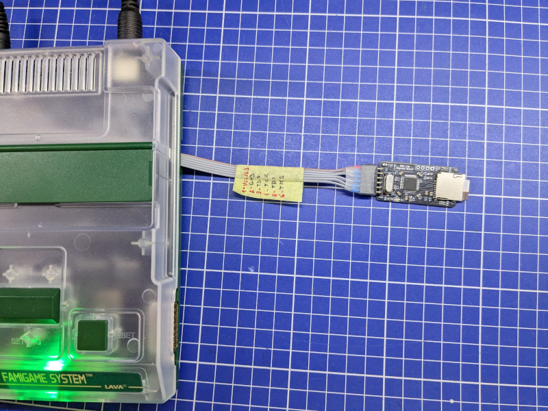

# Lava RSC Lite Upgrade Board

## DISCLAIMER

Any use of this project is **under your own responsibility**.
You will be responsible of checking the correct construction and functionality of your board.
By using this project You will agree that I cannot be held responsible if it will destroy any of your devices, damage your computer, burn down your house or whatever.

I want to stress this out: You're on your own using this. It works for me, I cannot give guarantees to you. Also, **do not go bother the Lava RSC people about it for support!!!**

## Introduction

The [Lava RSC](http://www.lava-fc.top/) is a family of very nice Famiclones that use ICs found in the original Famicom, complemented with an FPGA used to output an analog RGB picture.

From time to time, the people at Lava update the FPGA firmware to fix bugs and add new features.
The high end model, the Lava RSC, includes an SD card slot connected to an MCU, and is capable of updating the FPGA autonomously, while the Lite version requires an FPGA programmer and 
not-so-easy to obtain Anlogic software to complete the update.

This board reproduces the upgrade circuitry found in a Lava RSC, but as an external module. This way it's sufficient to install headers on your Lite motherboard (there are well marked
spots to solder one), if you want, bring out the signals via a flat cable, and connect this adapter when you want to perform the update. The rest works the same as the original Lava RSC
(beside requiring a Lite-specific firmware, of course).



### Ordering the boards

You can order the board for this project at [PCBWay](https://www.pcbway.com/project/shareproject/Lava_RSC_Lite_Famiclone_Upgrade_board_22eeb25e.html) and support me or download 
the gerbers and have them printed wherever you like!!!

## Hardware

The board was designed with [KiCad](https://kicad.org/) EDA.

### Bill of Materials

This board uses mostly SMD components, but the large footprint allows for handsoldering.

| Component              | Qty | Type / Value                     | Notes                                                                |
| ---------------------- | --- | -------------------------------- | -------------------------------------------------------------------- |
| R1                     |  1  | any 1206 resistor                | Pullup on BOOT 0 signal, any resistor will do, even a solder bridge  |
| R2, R4, R5, R9         |  4  | DNP                              | Not needed                                                           |
| R3, R7, R8             |  1  | 10K 1206 resistor                |                                                                      |
| R6                     |  1  | 1K 1206 resistor                 |                                                                      |
| RN1, RN2               |  2  | 4-resistor array 4x0612 (1206)   | Convex package, the resistors are isolated                           |
| C2, C3                 |  2  | 22pF 10V C0G 1206 capacitors     |                                                                      |
| C1, C5, C6-C10         |  7  | 100nF 10V 1206 capacitors        |                                                                      |
| C4, C11                |  2  | 10uF 10V 1206 capacitors         |                                                                      |
| SW1                    |  1  | DNP                              | Not needed                                                           |
| J1                     |  1  | DNP                              | Not needed                                                           |
| J2                     |  1  | 2x03 pinheader, 2.54mm           |                                                                      |
| J3                     |  1  | 4pin header, 2.54mm              |                                                                      |
| J4                     |  1  | 6pin header, 2.54mm              | I prefer using angled ones for this                                  |
| XS1                    |  1  | uSD connector                    | You can find compatible ones on [AliExpress](https://aliexpress.com/item/4000033854553.html) |
| Y1                     |  1  | 8Mhz crystal, HC-49SD            |                                                                      |
| U1                     |  1  | STM32F103C8T6, LQFP-48           | A compatible GD32F103C8T6 has been tested and found to be working    |

### Flashing the STM32

In this repository you'll find two firmware files:

- `McuFirmware.hex` provided directly by Lava
- `McuFirmware_dump.hex` that I dumped from my Lava RSC

They should both work for this purpose, the only known difference being that the first one searches for a file named `LavaRSCLite.aje` in the root of the SD card,
while the second searches for `LavaRSC.aje`.

You can use an st-link (a clone is fine) to flash this board via the SWD header (J3). Remember to power the board with 3.3V.

You can use the `st-flash` utility to program the device:
```
st-flash --format ihex .\McuFirmware_dump.hex
```

or use the STM32 ST-Link Utility software.

### Using the board to update the Lite

1. Make sure that the board has Boot 0 jumpered to GND (Jumper block J2)
2. Format an SD card to FAT32, leave it empty and copy the update files in it (with name `LavaRSC.aje` or `LavaRSCLite.aje` depending on the firmware you flashed the STM32 with). You'll find a Lite compatible firmware in this repository, equivalent to the Lava RSC firmware 1.7
3. Plug the SD card in
4. Wire the JTAG connector (J4) to the points of the same name on your Lite motherboard. Dupont wires are ok for this
5. Remove any cart inserted in the Lite
6. If connected, remove any wire connected to the SWD header on the upgrade board
7. Power on the Lite. After a few seconds, the LED on the upgrade board should start flashing
8. Wait until the LED stops flashing and remains on
9. Power off the Lite and remove the upgrade board
10. Done